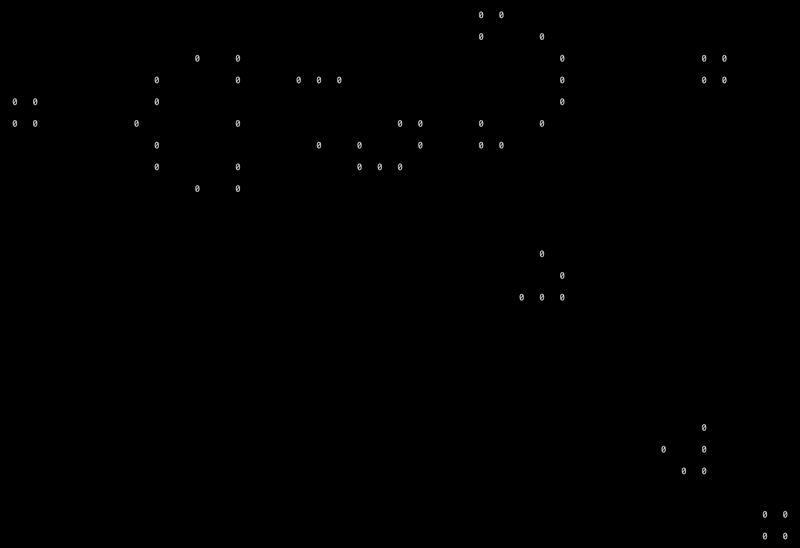

# A pure Python implementation of Conway's Game of Life


The game of life is a cellular automation simulation devised by the British mathematician John Horton Conway in 1970.

The only required inputs are the initial states of the different cells and the simulation runs on by itself based on some simple rules.

Gospers glider gun
<p algn='center'>
    
</p>

**The rules are:**

Every cell interacts with its eight neighbours, which are the cells that are horizontally, vertically, or diagonally adjacent. At each step in time, the following transitions occur:

1.   Any live cell with fewer than two live neighbours dies, as if by underpopulation.
2.   Any live cell with two or three live neighbours lives on to the next generation.
3.   Any live cell with more than three live neighbours dies, as if by overpopulation.
4.   Any dead cell with exactly three live neighbours becomes a live cell, as if by reproduction.

## Run

No external Python libraries required, however `Python 3.x` is required. This simulation only works in Linux/UNIX/BSD based systems.

```python
$ python game_of_life.py <rows> <cols> <file_name>
```

For example to simulate the glider_gun pattern in a 25x44 cell space, run:

```python
$ python game_of_life.py 25 44 init_patterns/glider_gun.txt
```

### File formats

The files can be in `csv` format where the live cells coordinates are given:

For example, the block.csv has the format:

    3,5
    3,6
    4,5
    4,6

Or the files can be in `txt` format where the live cells are represented by `O` (Big O) and dead cells by `.`:

For example, the glider.txt has the format:

    .O.
    ..O
    OOO


### Acknowledgemnts

-   [Game of Life](https://en.wikipedia.org/wiki/Conway%27s_Game_of_Life)
